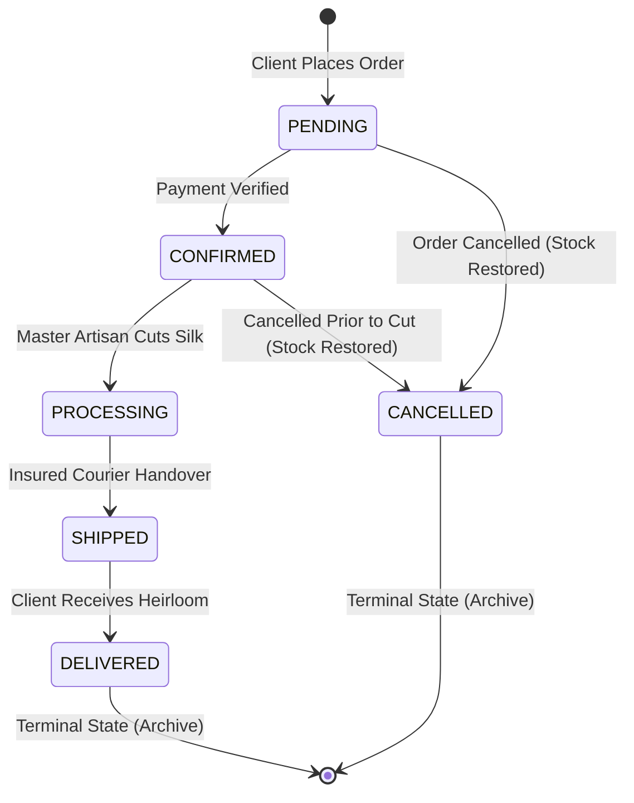
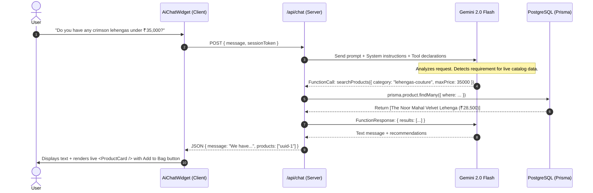

# Zaria Atelier — Architectural Technical Specification

> Comprehensive system design, data flow diagrams, concurrency safeguards, state machines, and styling foundations for the Zaria Atelier Indian Luxury E-Commerce platform.

---

## 1. Architectural Overview

Zaria Atelier is designed as a **high-concurrency, editorial-first luxury e-commerce platform** engineered using **Next.js 14 (App Router)**, **TypeScript**, **Tailwind CSS**, and **PostgreSQL** orchestrated through **Prisma ORM**.

```mermaid
flowchart TB
    subgraph Client ["Client Presentation Layer (Next.js 14 App Router)"]
        direction TB
        Storefront["Editorial Storefront (/app/(storefront))"]
        Catalogue["Catalogue & Filter Engine (/shop)"]
        PDP["Product Detail with Dynamic Variant Matrix"]
        Cart["Zustand Client Store (localStorage Persist + Hydration Guard)"]
        Concierge["Zaria AI Concierge (Floating Widget + Holographic Seal)"]
        ThemeEngine["Nocturne Atelier Theme Engine (Dark / Light Context)"]
    end

    subgraph API ["Serverless API Layer (Route Handlers)"]
        direction TB
        AuthApi["/api/auth/[...nextauth] — NextAuth JWT"]
        ProductsApi["/api/products — Multi-facet SQL Filtering"]
        CouponApi["/api/coupon/validate — Time & Threshold Rules"]
        CheckoutApi["/api/checkout — Atomic Prisma Transaction"]
        OrdersApi["/api/orders/[id]/* — State Machine Transitions"]
        AdminApi["/api/admin/* — Role-Gated Vault Management"]
        ChatApi["/api/chat — Gemini 2.0 Function Calling Loop"]
    end

    subgraph Database ["Persistence Layer (PostgreSQL)"]
        direction TB
        PrismaClient["Prisma ORM Client (Singelton Instance)"]
        DB[(PostgreSQL Database\n- Users & NextAuth Accounts\n- Products, Variants & Images\n- Inventory (CHECK quantity >= 0)\n- Orders & OrderItems\n- OrderStatusHistory\n- Coupons\n- ChatSessions & Messages)]
    end

    subgraph AI ["AI Intelligence Layer (Google Gemini)"]
        GeminiFlash["Gemini 2.0 Flash Engine"]
        ToolExecutor["Server-Side Tool Declarations:\n- searchProducts()\n- getProductById()\n- checkStock()\n- getStoreInfo()"]
    end

    Storefront --> ProductsApi
    Catalogue --> ProductsApi
    PDP --> Cart
    Cart --> CheckoutApi
    Concierge --> ChatApi
    ChatApi <--> GeminiFlash
    GeminiFlash <--> ToolExecutor
    ToolExecutor --> PrismaClient
    
    AuthApi --> PrismaClient
    ProductsApi --> PrismaClient
    CouponApi --> PrismaClient
    CheckoutApi --> PrismaClient
    OrdersApi --> PrismaClient
    AdminApi --> PrismaClient
    PrismaClient --> DB
```

---

## 2. Directory & Component Structure

```
Boutique_ecommerce/
├── prisma/
│   ├── schema.prisma            # Normalized relational data schema
│   └── seed.ts                  # Master seeder with 17 couture items, users, and coupons
├── public/
│   └── ai-avatar.jpg            # Zaria Concierge luxury portrait asset
├── src/
│   ├── app/
│   │   ├── (storefront)/        # Storefront route group
│   │   │   ├── account/         # Client order history & session management
│   │   │   ├── cart/            # Curated bag review with coupon engine
│   │   │   ├── checkout/        # Encrypted checkout with simulated payment
│   │   │   ├── orders/[id]/     # Dynamic order timeline & cancellation
│   │   │   ├── product/[slug]/  # Editorial PDP with multi-angle gallery
│   │   │   └── shop/            # Filterable catalogue with category query sync
│   │   ├── admin/               # Role-gated management portal
│   │   ├── api/                 # REST & AI Route Handlers
│   │   ├── globals.css          # Custom tokens, luxury typography, scrollbar
│   │   ├── layout.tsx           # Root layout with anti-FOUC script & providers
│   │   ├── page.tsx             # Curated Atelier home page
│   │   └── providers.tsx        # React Query & NextAuth providers
│   ├── components/
│   │   ├── animations/          # GSAP AtelierIntro, Lenis SmoothScroll, CustomCursor
│   │   ├── cart/                # CartDrawer slide-in with live subtotal
│   │   ├── chat/                # Zaria Concierge floating widget & avatar
│   │   ├── storefront/          # Navbar, Footer, ProductCard, HeroSection
│   │   ├── theme/               # ThemeProvider & ThemeToggle
│   │   └── ui/                  # Reusable accessible button, badge, input primitives
│   ├── hooks/
│   │   └── useCart.ts           # Zustand cart store with localStorage persistence
│   └── lib/
│       ├── auth.ts              # NextAuth credentials provider & JWT callbacks
│       ├── gemini.ts            # Gemini 2.0 Flash AI client & tool signatures
│       ├── prisma.ts            # Global Prisma Client singleton
│       ├── state-machine.ts     # Formal order status transition engine
│       └── utils.ts             # Currency formatter, class merger, SKU generator
```

---

## 3. Data Integrity & Concurrency Safeguards

### 3.1. Zero-Overselling Atomic Conditional Decrement
In multi-user luxury e-commerce with limited-edition couture items (e.g. 1-of-1 bridal lehengas), standard `SELECT -> UPDATE` patterns fail under concurrent traffic.

Zaria Atelier solves this through **Atomic Conditional SQL Decrement**:
```typescript
// Executed inside prisma.$transaction:
const updatedInventory = await tx.$executeRaw`
  UPDATE "Inventory"
  SET quantity = quantity - ${item.qty},
      "updatedAt" = NOW()
  WHERE "variantId" = ${item.variantId}
    AND quantity >= ${item.qty};
`;

if (updatedInventory === 0) {
  throw new Error(`INSUFFICIENT_STOCK: Item ${item.sku} is no longer available in the vault.`);
}
```

### 3.2. PostgreSQL Kernel Check Constraint
Even if an application error were to bypass backend validations, the database enforces physical non-negativity:
```sql
ALTER TABLE "Inventory" 
ADD CONSTRAINT check_inventory_non_negative CHECK (quantity >= 0);
```

### 3.3. Historical Price Snapshots
Product prices evolve, but client receipts must reflect legal accuracy at the exact second of purchase:
```prisma
model OrderItem {
  id                  String   @id @default(uuid())
  orderId             String
  variantId           String
  sku                 String
  title               String
  color               String
  size                String
  qty                 Int
  unitPriceAtPurchase Int      // Stored in INR paise / whole rupees
  subtotal            Int
}
```

---

## 4. Order Lifecycle State Machine

Orders adhere to a deterministic Finite State Machine (FSM) implemented in `src/lib/state-machine.ts`:



### Key FSM Rules:
1. **Cancellation Window**: An order may only be cancelled while in `PENDING` or `CONFIRMED`. Once tailoring begins (`PROCESSING`), cancellation is locked.
2. **Atomic Inventory Reversion**: When an order transitions to `CANCELLED`, all associated `OrderItem` quantities are automatically restored to the `Inventory` table within the same transaction.
3. **Audit History**: Every status modification appends a permanent record in `OrderStatusHistory` capturing timestamp and artisan notes.

---

## 5. Zaria AI Concierge Architecture

The AI assistant operates on Google DeepMind's `gemini-2.0-flash` with **Native Function Calling**.



---

## 6. Nocturne Atelier Theme Engine

Zaria Atelier supports two luxury palettes:
- **Ivory Mode**: Warm parchment (`#FAF7F2`), deep imperial oxblood (`#4A0E17`), and antique gold accents (`#C9A050`).
- **Nocturne Mode**: Obsidian velvet (`#0C0A0B`), midnight noir (`#141012`), warm champagne text, and gilded borders (`#D4AF37`).

### Anti-FOUC (Flash of Unstyled Content) Prevention
A blocking inline script executes in `<head>` before the DOM mounts, inspecting `localStorage` or `prefers-color-scheme` to attach the `.dark` class immediately:
```html
<script>
  (function() {
    try {
      var key = 'zaria-theme-mode';
      var theme = localStorage.getItem(key);
      var isDark = theme === 'dark' || (!theme && window.matchMedia('(prefers-color-scheme: dark)').matches);
      if (isDark) document.documentElement.classList.add('dark');
      else document.documentElement.classList.remove('dark');
    } catch (e) {}
  })();
</script>
```

---

## 7. Hydration Safeguards

Next.js SSR paired with client-persisted Zustand stores (`localStorage`) inherently risks hydration mismatches because the server renders with empty carts while the client loads user items.

### Solution Pattern:
Components that conditionally render based on client storage (e.g. [Navbar.tsx](file:///d:/Internship%20Challege/Boutique_ecommerce/src/components/storefront/Navbar.tsx), [CartPage](file:///d:/Internship%20Challege/Boutique_ecommerce/src/app/(storefront)/cart/page.tsx), [CheckoutPage](file:///d:/Internship%20Challege/Boutique_ecommerce/src/app/(storefront)/checkout/page.tsx)) utilize a `mounted` lifecycle guard:
```tsx
const [mounted, setMounted] = useState(false);
useEffect(() => {
  setMounted(true);
}, []);

const itemCount = mounted ? getItemCount() : 0;
```
During SSR and initial DOM hydration, `mounted` is `false`, ensuring 100% markup parity before hydrating the dynamic count badge.
